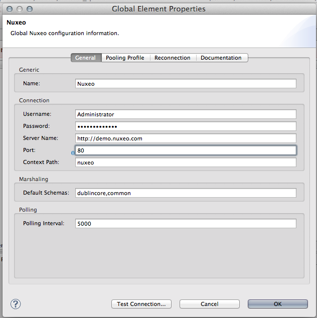
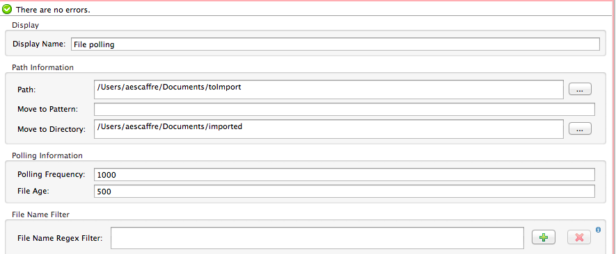
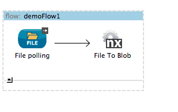

[Purpose](#purpose)  

[Prerequisites](#prerequisites)  

[Step 1: Install a Nuxeo Server ](#step-1)    

[Step 2: Install Mule Nuxeo Connector from update Site](#step-2)   

[Step 3: Create Demo Project](#step3)  

[Step 4: Add Nuxeo Connector in your flow](#step4)   

[Other Resources](#other)    

### Purpose

This document provides detailed instructions on how to install Nuxeo Connector for Mule and demonstrates how to build and run simple demo application that uses this connector.

### Prerequisites

In order to build and run this project you'll need:

* a Nuxeo server
     - You can [download](http://www.nuxeo.com/en/downloads) and [install](http://doc.nuxeo.com/display/ADMINDOC/Installation) a server 
     - You can run against the public [Nuxeo demo server](http://demo.nuxeo.com/nuxeo/)
     - You can use a nuxeo.io instance

* [MuleStudio](http://www.mulesoft.org/download-mule-esb-community-edition).

* Web browser.

### Step 1: Install a Nuxeo Server

Follow instructions on [Adminsitration and Installation](http://doc.nuxeo.com/display/public/ADMINDOC/Installation) documentation of Nuxeo. You may also want to customize your Nuxeo Set up using [Nuxeo Studio](http://doc.nuxeo.com/x/bgTF).

### Step 2: Install Mule Nuxeo Connector from update Site

*    In Mule Studio select **Help** \> **Install New Software...**.

*    Select **MuleStudio Cloud Connectors Update Site** in **Work With** drop-down.

*    Check one item from Community folder: **Nuxeo Connector** and click **Next**.

*    Follow installation steps.

Alternatively, you can usee the [update site provided by Nuxeo QA](https://qa.nuxeo.org/jenkins/job/nuxeo-mule-connector-master/lastSuccessfulBuild/artifact/target/update-site/)

### Step 3: Create Demo project

1.    Run Mule Studio and select **File \> New \> Mule Project** menu item. 

1.    Type **Demo** as a project name.

1.    Select CloudHub Mule Runtime for Server Runtime property.

1.    Click **Next** twice

1.    You should be using jdk 1.7 - if not make sure to install it

1.    Click next once again then click **finnish** to end up the wizzard. You should now be in front of an empty flow editor.

1. Global configuration of a Nuxeo Server

   We need to declare globally the Nuxeo connections that we will use. For this tutorial, we need to create a connection to Nuxeo demo server: http://demo.nuxeo.com (Administrator/Administrator). You can also use a local setup)
   
   1. Click on Global Elements tab, then Create, Filter using "Nuxeo" and choose the Cloud Connector
   
   1. Fill username Administrator, password Administrator, Server Name : http://demo.nuxeo.com Port:80 (or localhost:8080). 

   

   
   1. Save and go back to your flows view.

### Step 4: Implement a flow that uploads a file in Nuxeo

**Goal**: We want to poll a specific folder in the file system so that each time a file is dropped there, it is uploaded in Nuxeo, under the */default-domain/workspaces* folder.	

1. Drop a File endpoint in the middle of the flow editor. This will create a new flow called "DemoFlow1".

1. Select it, this opens the property editor for this element on the bottom part of the screen. Rename it "File_upload". Let other option as is.

1. Select the File Endpoint inside File_upload flow and edit its properties on the bottom part:
   - **Display name**: File polling
   
   - **Path**: select a path where you will drop the files for your tests
   
   - **Move to directory**: select a path where the files will be moved after having been imported to Nuxeo

   
   
    - Let other properties unchanged, and click back to the flow editor and save it.
    
   

1. Drop a "Nuxeo" transformer so as to transform the File in a Nuxeo Blob (required by the Nuxeo Connector). Set the following properties then go back to the flow editor and save:
   - **Display Name**: File To Blob
   - **Operation**: File to Blob

   

1. Drop a "Set Variable" component. Goal is to set the Nuxeo blob as a variable in the flow, so as to re-use it later, once the File document that will hold it has been created in Nuxeo. Fill the following properties on the component:
   - **Display Name**: Set as FileToUpload
   - **Operation**: Set Variable
   - **Name**: FileToUpload
   - **Value**: #[payload]
   
1. Drop a Nuxeo Connector at the end of the flow so as to create the document on the Nuxeo server that will hold the binary that we want to upload. Edit the following properties:
   - **Display Name**: Create document
   - **Config reference**: Choose the Nuxeo config of your choice (the one you created at the begining of this tutorial)
   - **Operation**: Choose *Create Document*
   - **Parent document reference**:/default-domain/workspaces
   - **Document Type**: File
   - **name of the document**:#[payload.file.name]
   - **properties**: choose "Create Object Manually" then
       1. Select the k:v Map <String,Object> row and click on the "+" icon.
       1. Fill the metadata that should be part of the document once created:
          - Name: dc:title  Value: #[filename]
          - Name: dc:description: Value : a decription of the file
          
            
       1. Go back to the flow editor and save
    
1. Drop a Set Variable component. Goal is to save the document id that was just created so as to reference it when we will upload the file to the server. Use the following property values:
   - **Display Name**: Save Document id
   - **Operation**: Set variable
   - **Name**: FileDocumentId
   - **Value**: #[payload.id]
      
1. Drop a "Set Payload" component at the end, so as to get the blob (binary) back in the payload for uploading it in the step after to the newly created document, with SetBlob Nuxeo operation, using Nuxeo connector. Configure the following properties on the "Set Payload" component:
   - **Display Name**:Set the file as Payload 
   - **Value**:#[FileToUpload]
   
   
1. Drop a new Nuxeo Connector with the following properties
   - **Display Name**:Upload
   - **Config Reference**: Choose the Nuxeo server you want for creating the File Document
   - **Operation**: Set Blob
   - **Doc**: #[FileDocumentId]
   - **Blob Reference**: #[payload]
   - **XPath**: file:content
  
  
1. **Test the flow: right click on the file "Demo.mflow" > Run As > Mule Application, then drop  files under the import folder you chose, and check documents are created with the files on the Nuxeo sever.**

You can also copy past the [XML flow](resources/demo.mflow) and change a few config elements (mainly fs paths).

Note: You could also have used the operation "FileManager.Import" so as to create the document and upload the file in one step. In the flow we chose to detail, you controle everything: type of the created document, title, name of the file, … Using FileManager.Import will provide a much shorter flow, though with less control on what is done, but may suit simple file upload use case!

#### Use the Nuxeo event polling endpoint.

1. Create a new flow File, call it "pollingEventsFromNuxeo"

### Other Resources

For more information on:

- Nuxeo Platform, please visit [http://doc.nuxeo.com/](http://doc.nuxeo.com/display/MAIN/Nuxeo+Documentation+Center+Home)

- Nuxeo Automation API, please visit [http://doc.nuxeo.com/display/NXDOC/Platform+APIs#PlatformAPIs-RESTAPI](http://doc.nuxeo.com/display/NXDOC/Platform+APIs#PlatformAPIs-RESTAPI)

- Mule AnyPoint™ connectors, please visit [http://www.mulesoft.org/connectors](http://www.mulesoft.org/connectors)

- Mule platform and how to build Mule apps, please visit [http://www.mulesoft.org/documentation/display/current/Home](http://www.mulesoft.org/documentation/display/current/Home)

